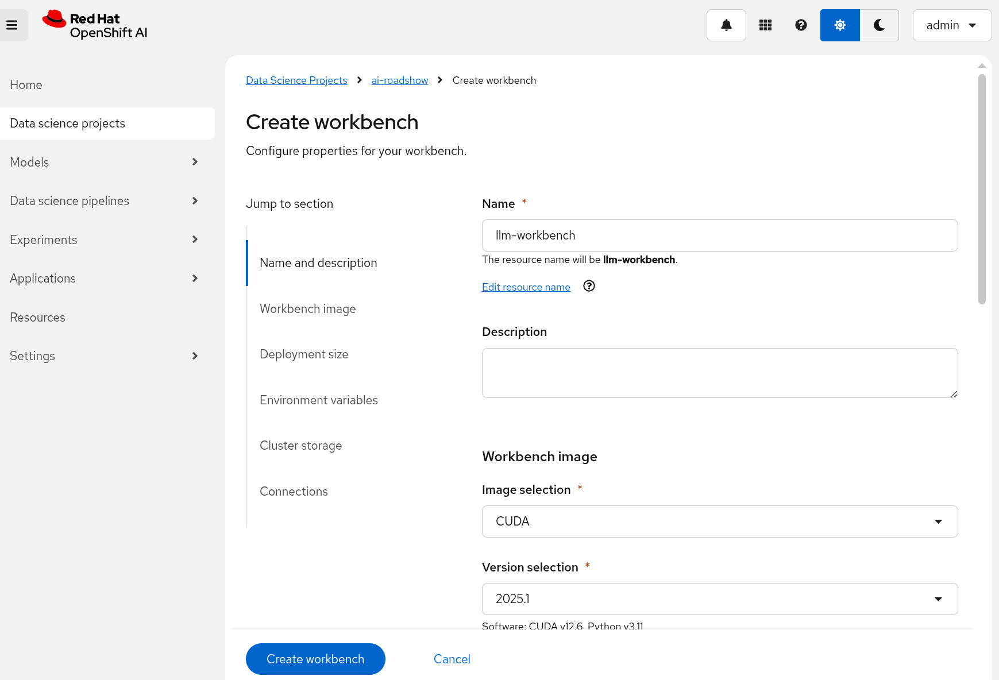
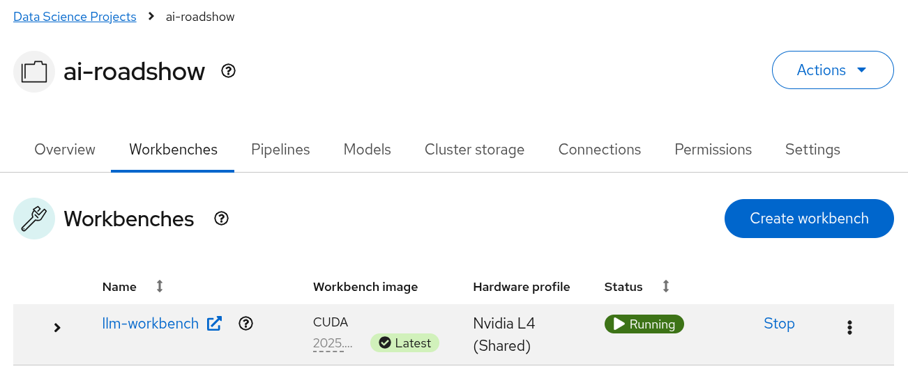
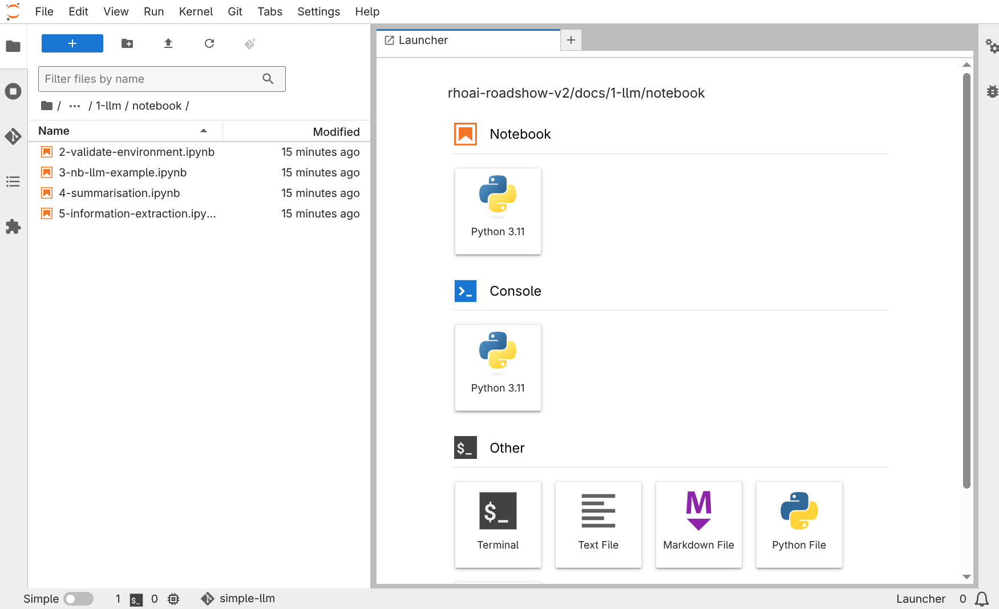

# 💁 Introduction

In this exercise we will configure the workbench that you will use for the lab. Follow the steps described in this document to configure the lab environment.

# Login to OpenShift AI

Your instructor will supply you with a link that you will use to login to your OpenShift AI cluster.

1. Open the OpenShift AI console using the url provided by your instructor.  
2. Use the following credentials to login to OpenShift AI:  
      **Username:** *admin*  
      **Password:** *(Your instructor will supply your passowrd on the day.)*

# Create a workbench

3. Select the `ai-roadshow` data science project.

4. Enter the following details into the **Create workbench** form:

   Name: **rag-workbench**  
   Image Selection: **CUDA**  
   Version: **2025.1 (Recommended)**  
   Hardware profile: **NVIDIA L4 (Shared)**  

5. Click **Create workbench**

OpenShift AI creates and starts the workbench.

Wait for the status to change to *Running*.  

The workbench has now been created. You will now open the workbench, which will launch **JupyterLab**, your IDE for the lab.  

---

# Open the Jupyter notebook

6. Click **rag-workbench** to open **JupyterLab**.  
   In the login dialog box, enter the same credentials you used to log into OpenShift at the start of this lab.

7. Click **Login**  
   OpenShift AI launches JupyterLab.  

With JupyterLab now running, you will now download all of the lab materials:  
8. Click the **Git** button in the toolbar on the left side of JupyterLab.  

  

4. Click **Clone a Repository**  
   OpenShift AI prompts you to enter the repository URL and other options.  

5. Copy and paste the following into the *URI of the remote Git repository* text box: `https://github.com/odh-labs/rhoai-roadshow-v2.git`  
6. Click **Include submodules**.  

 

7. Click **Clone**.  
   JupyterLab copies the source code from GitHub into your Workspace.

 

8. In the *File Explorer* panel, navigate into the directory: `/rhoai-roadshow-v2`  

  

9. Double click `1-llm.jupyterlab-workspace` to open the workspace for this activity.  
   JupyterLab opens the workspace. All of the notebooks you will use are visible in the *File Explorer*.  

  

When done, you have successfully connected to your environment and this completes this activity. Click the link below to move to the next activity 'Validate the lab environment'.