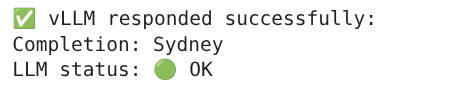

# Validate the Lab Environment

Now that you are connected to your workbench, you will validate that the lab environment has been properly configured with everything that is needed to successfully run the lab.

From the `rhoai-roadshow-v2/lab-materials/1-llm` folder, please open the notebook called: `2-validate-environment.ipynb`.

Follow all instructions from inside the Notebook. If your environment has been provisioned correctly then you will see a result like the following image:

When done, you can close the notebook and head to the next activity by clicking the link below.
