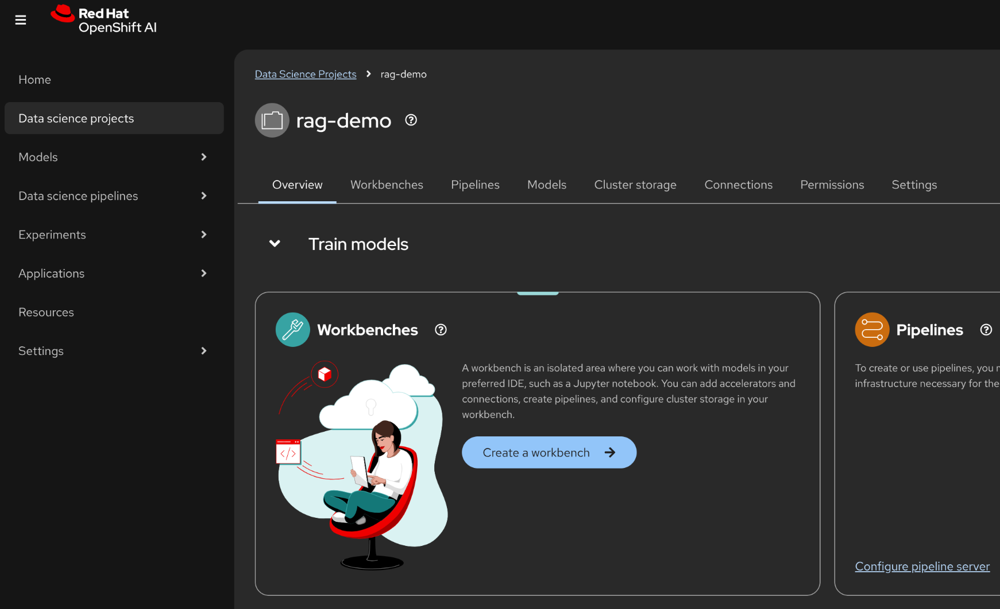
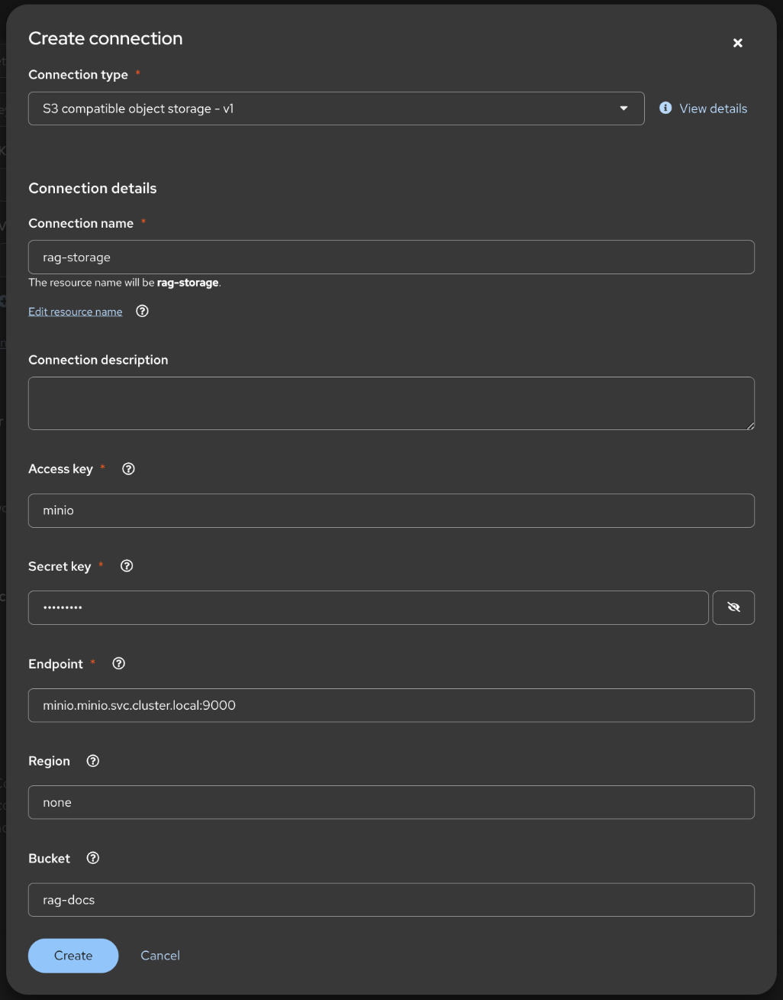
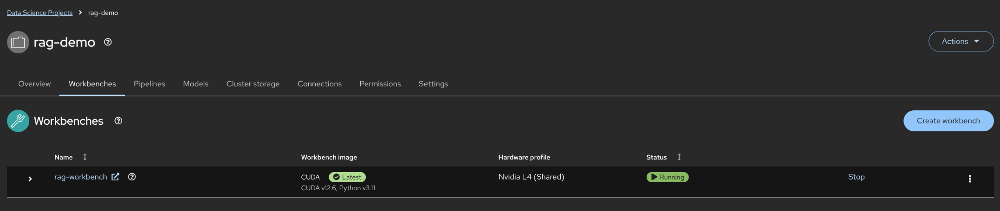

# 💁 Introduction

In this exercise we will run a `shakeout` script to validate that the envonrment setup is correct and that the labs will operate properly.

# 🧑‍🏫 Instructions 

## Create a workbench

1. Login to OpenShift AI and select the `rag-demo` data science project.



2. Enter the folling details into the **Create workbench** form:

    Name: **rag-workbench**  
    Image Selection: **CUDA**  
    Version: **2025.1 (Recommended)**  
    Hardware profile: **NVIDIA L4 (Shared)**  


---

### Enter the S3 storage credentials

3. Scroll down to the **Add a connection** section 

1. Click the **Create connection** button.
2. Click **S3 compatible object storage - v1** from the *connection-type* drop-down list.
3. Enter the following details into the form:  
   Connection name: **rag-s3-storage**  
   Access key: **minio**  
   Secret key: **minio1234**  
   Endpoint: **minio.minio.svc.cluster.local:9000**  
   Region: **none**  
   Bucket: **rag-docs**  
4. Click **Save**.  



5. Click **Create**.

⚠️ **Note:** You may receive a warning from your browser informing you of a weak password. You can safely ignore that warning.


6. Click **Create workbench**

OpenShift AI creates and starts the workbench.



Wait for the status to change to *Running*

---

## Open the Jupyter notebook

1. Click **rag-workbench** to open the Jupyter notebook.

In the login dialog box, enter the same credentials you used to log into OpenShift at the start of this lab.

2. CLick **Login**

---

## Open the first notebook in your workbench

Clone the code using your github user into your workbench by using the `Terminal` and entering:

```bash
git clone https://github.com/odh-labs/rhoai-roadshow-v2
```


Open up the following notebook in your workspace.

<a href="https://github.com/odh-labs/rhoai-roadshow-v2/blob/main/docs/3-agents-tools/notebooks/Level1_getting_started_with_Llama_Stack.ipynb" target="_blank">Level1_getting_started_with_Llama_Stack.ipynb</a>

In this notebook we will help you set up your environment for this tutorial.

We will cover installing the necessary libraries, configuring essential parameters, and connecting to a Llama Stack server.


