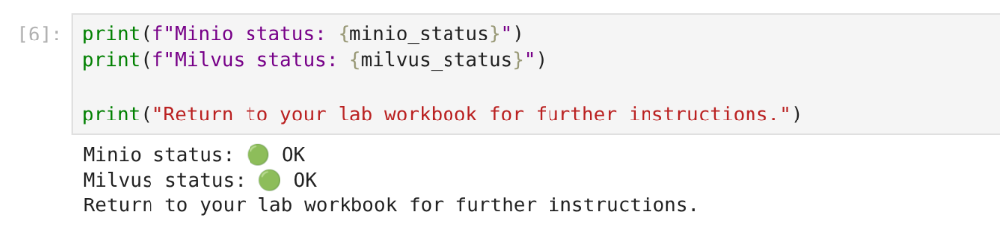

# Validate the Lab Environment

Npw that you are connected to your workbench, you will validate that the lab environment has properly configured with everything that is needed to successfully run the lab.

In JupyterLab, open the notebook: `2-validate-environment.ipynb`.

Follow all instructions from inside the Notebook. If your environment has been provisioned correctly then you will see a result like the following image:

 

When done, you can close the notebook and head to the next page.