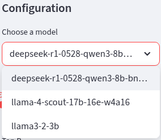
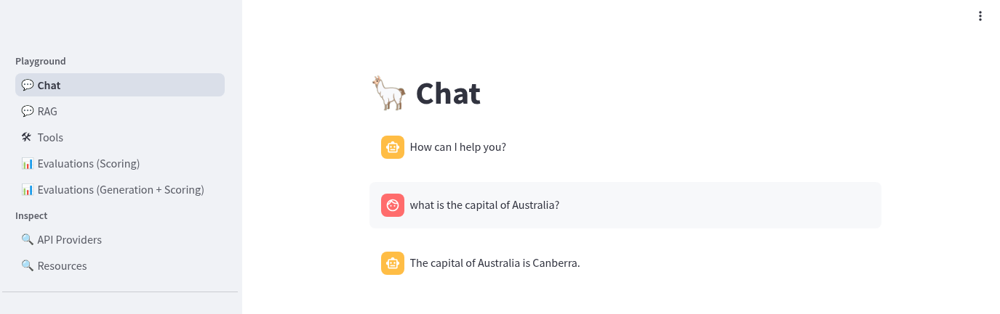
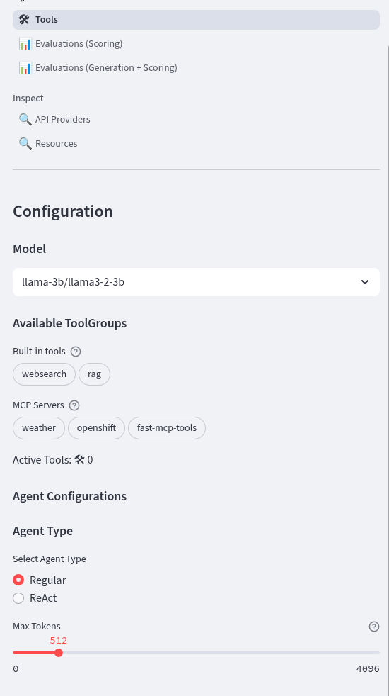
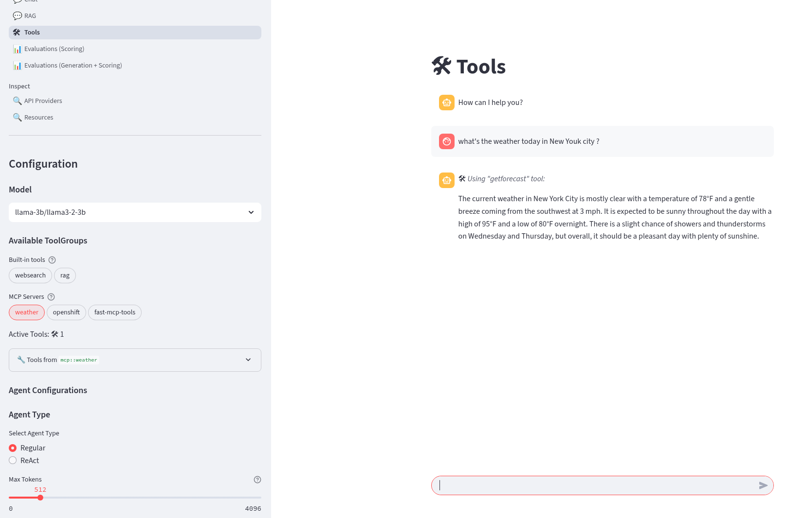

# Introduction

Let's explore the LLamaStack playground application first. This is a [Streamlit](https://streamlit.io/) built application that allows you to explore your LLamaStack deployment. You should be able to browse and login here.

<a href="https://llama-stack-playground-agent-demo.apps.sno.<CLUSTER_DOMAIN>" target="_blank">LLamaStack playground</a>

## LLamaStack

[LLamaStack](https://llama-stack.readthedocs.io/en/latest/) is the open-source framework for building generative AI applications. We have a LLamaStack server configured for our use and we are going to take a look around using the playground UI.

If you are intersted in how to configure LLamaStack, checkout the [docs](https://llama-stack.readthedocs.io/en/latest/) and you can also take a look at the running config in your cluster:

<a href="https://console-openshift-console.apps.sno.<CLUSTER_DOMAIN>/k8s/ns/agent-demo/configmaps/run-config" target="_blank">ConfigMap run-config</a>

## Models

We have three models configured in LLamaStack. Two of them are available to `Chat` to i.e. are type `llm` in the model dropdown. The third model is an embedding model.

```yaml
models:
- metadata: {}
  model_id: ${env.LLAMA3B_MODEL}
  provider_id: llama-3b
  model_type: llm
- metadata: {}
  model_id: ${env.DEEPSEEK_MODEL}
  provider_id: deepseek
  model_type: llm
- metadata:
    embedding_dimension: 384
  model_id: all-MiniLM-L6-v2
  provider_id: sentence-transformers
  model_type: embedding
```



The models are small in terms of parameter size (3b and 8b) and the DeepSeek model is quantized to 4-bit. This reduces the amount of memory they consume on the GPU. Even so we are using 18Gi of nvram to run the LLM's. If you browse to the <a href="https://console-openshift-console.apps.sno.<CLUSTER_DOMAIN>/k8s/ns/llama-serving/core~v1~Pod" target="_blank">Deepseek Pod</a> enter the `Terminal` and run `nvtop` on the command line to see the GPU performance.


## Chat

You can chat with either of the two LLM models. You should note that the LLama model is an [instruction tuned model](https://huggingface.co/meta-llama/Llama-3.2-3B) whilst the Deepseek model is a [reasoning model](https://huggingface.co/unsloth/DeepSeek-R1-0528-Qwen3-8B-bnb-4bit). Deepseek will produce reasoning tokens (between \<think\>) where it will try to break a problem down into steps prior to generating output tokens.



## RAG

LLamaStack is configured to use an inbuilt version of the [Milvus vector database](https://llama-stack.readthedocs.io/en/latest/providers/vector_io/milvus.html) for Retrieval Augmented Generation (RAG).

```yaml
  vector_io:
  - provider_id: milvus
    provider_type: inline::milvus
    config:
      db_path: ${env.MILVUS_DB_PATH}
```

If you want, you can try it out by uplaoding a TXT, PDF, DOC, DOCX document, then `Create Document Collection` and use it for RAG.


I uploaded the famous`bitcoin.pdf` document from Satoshi 🤑

## Tools, Agents and MCP Servers

We are going to deep dive into Agents and Tools, Model Context Protocol servers (MCP) in this section and see how we can create and use them. 

The LLamaStack playground is configured for many tools - for example check the ConfigMap for tool_groups.

```yaml
tool_groups:
- provider_id: tavily-search
  toolgroup_id: builtin::websearch
```

You can select tools and agents in the playground.



For example, select the `weather` MCP server, LLama model and Regular agent - and try asking for the weather in New York today


