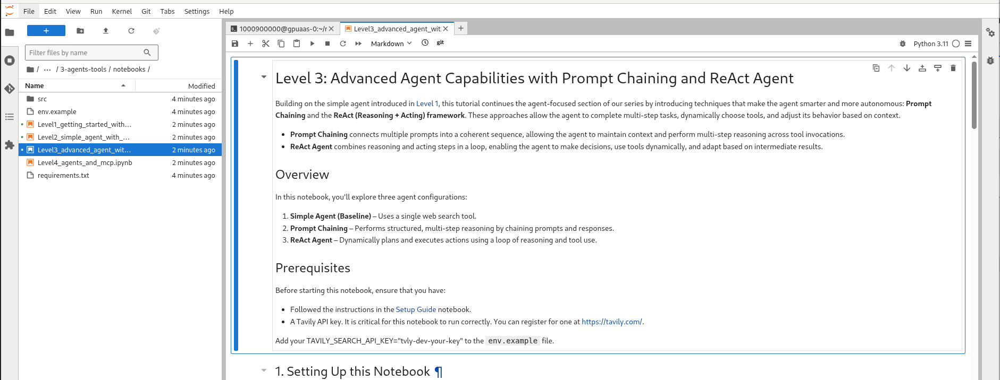

# Advanced Agent with Prompt Chaining and ReAct

Open up the following notebook in your workspace.

<a href="https://github.com/odh-labs/rhoai-roadshow-v2/blob/main/site/docs/3-agents-tools/notebooks/Level3_advanced_agent_with_Prompt_Chaining_and_ReAct.ipynb" target="_blank">Level3_advanced_agent_with_Prompt_Chaining_and_ReAct.ipynb</a>

In this notebook we will build on the simple agent introduced in [simple agent workflows](3-agents-tools/2-simple-agent-with-websearch). This tutorial continues the agent-focused section of our series by introducing techniques that make the agent smarter and more autonomous: **Prompt Chaining** and the **ReAct (Reasoning + Acting) framework**.

These approaches allow the agent to complete multi-step tasks, dynamically choose tools, and adjust its behavior based on context.

