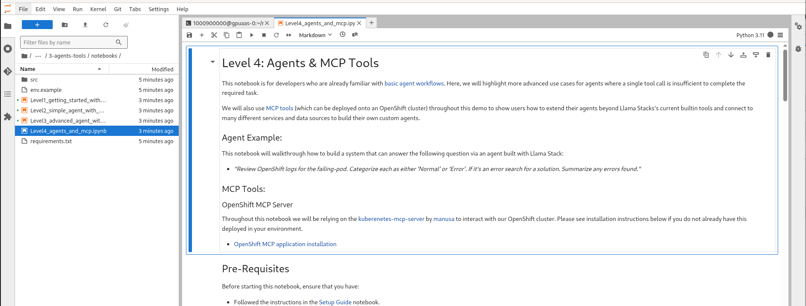

# Agents and MCP

Open up the following notebook in your workspace.

<a href="https://github.com/odh-labs/rhoai-roadshow-v2/blob/main/site/docs/3-agents-tools/notebooks/Level4_agents_and_mcp.ipynb" target="_blank">Level4_agents_and_mcp.ipynb</a>

This notebook is for developers who are already familiar with [basic agent workflows](3-agents-tools/2-simple-agent-with-websearch). Here, we will highlight more advanced use cases for agents where a single tool call is insufficient to complete the required task.

We will also use [MCP tools](https://github.com/modelcontextprotocol/servers) (which can be deployed onto an OpenShift cluster) throughout this demo to show users how to extend their agents beyond Llama Stacks's current builtin tools and connect to many different services and data sources to build their own custom agents.  

