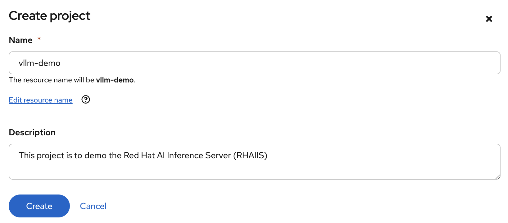
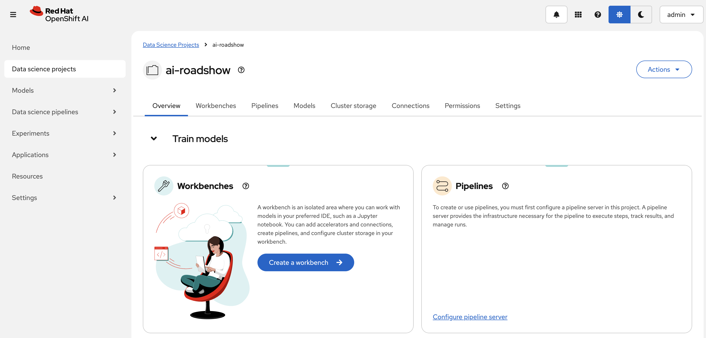
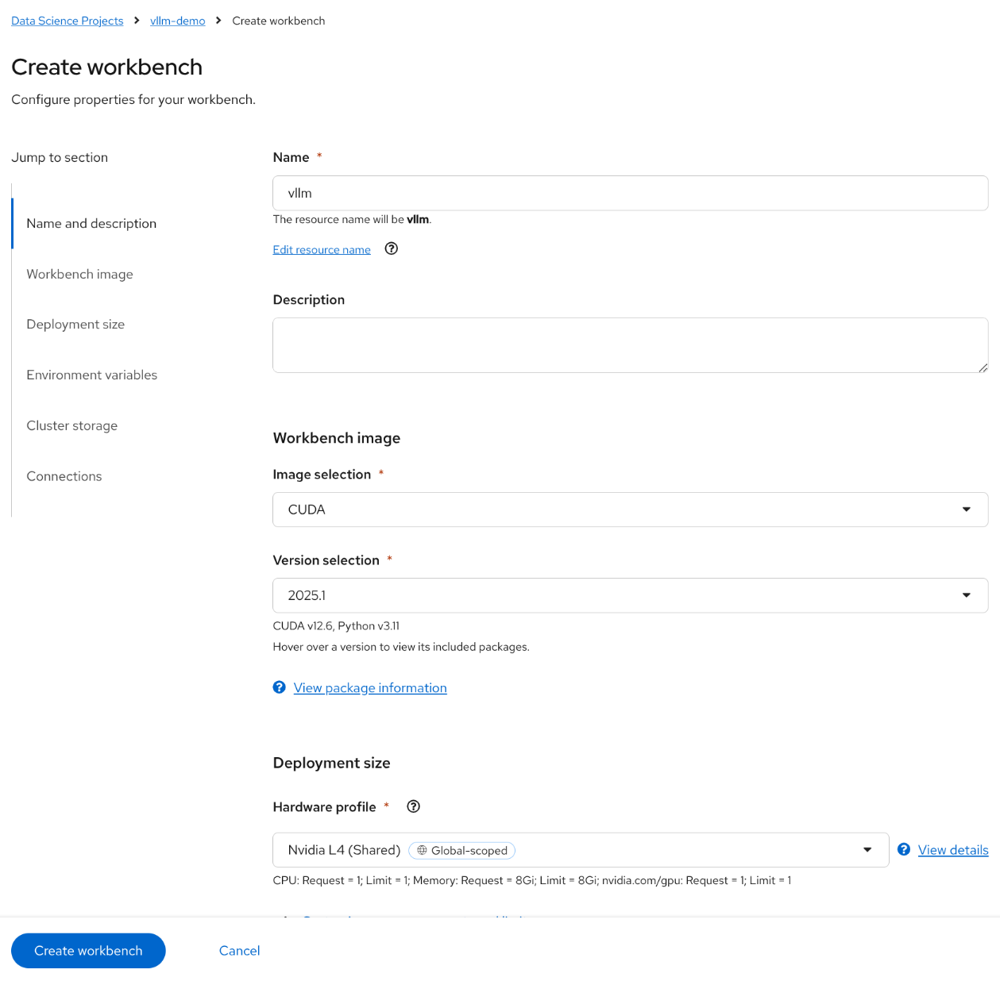
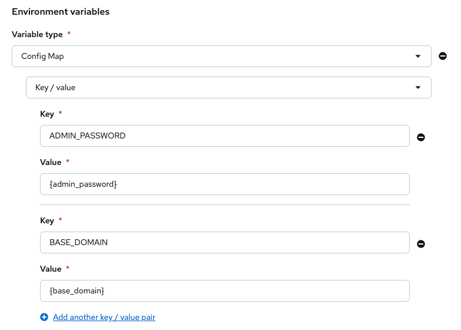
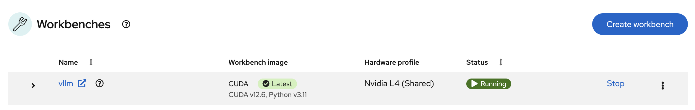
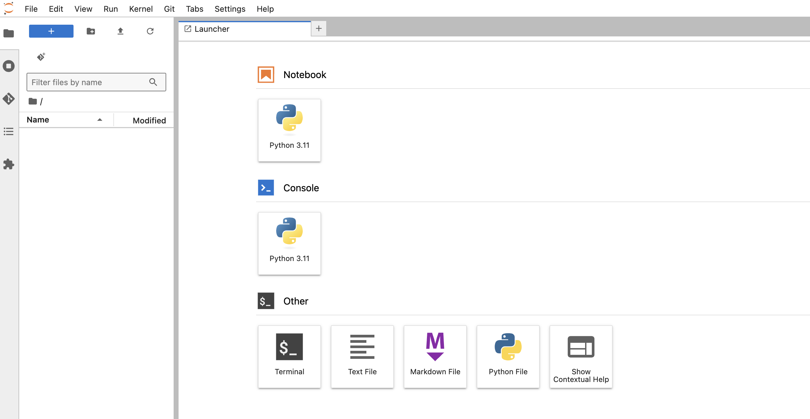
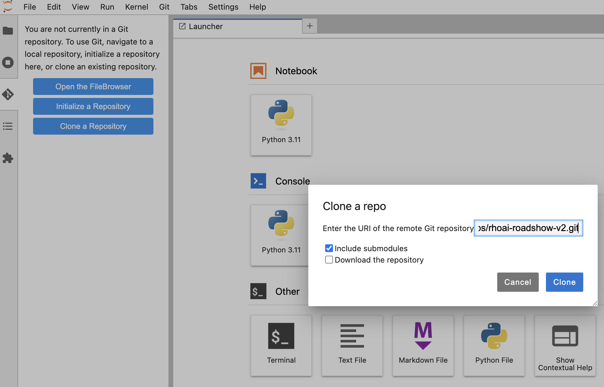
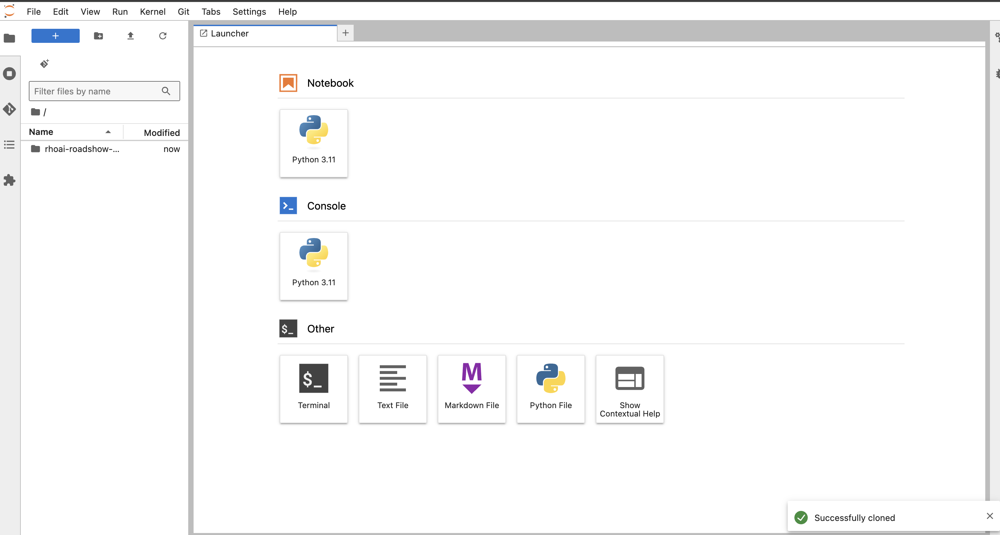
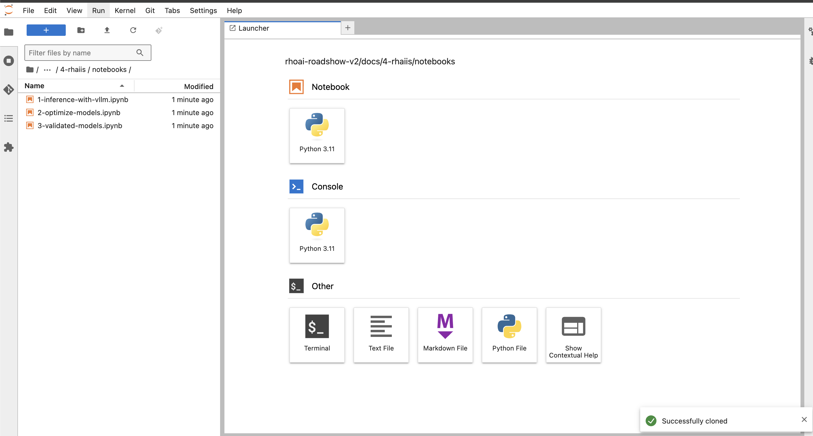

# 💁 Introduction

In this exercise we will configure the workbench that you will use for the lab. Follow the steps described in this document to configure the lab environment.

# Access the environment
Log into OpenShift AI using the credentials you have been provided.

# Create a project

1. Click **Data science projects** in the navigation pane.  
   OpenShift AI lists all of the existing projects.  

2. Click **Create project**.  

3. enter the follwing into the **Create project** form:  
   **Name:** `vllm-demo`  
   **Description:** `This project is to demo the Red Hat AI Inference Server (RHAIIS).`

4. Click **Create**.  
   OpenShift AI creates the new project and displays the project details.

5. Click **Create a workbench** in the **Workbenches** group box.  
   OpenShift AI displays a form to enter the workbench details.

6. Enter the following details into the **Create workbench** form:   
   Name: **vllm**  
   Image Selection: **CUDA**  
   Version: **2025.1 (Recommended)**  
   Hardware profile: **NVIDIA L4 (Shared)**  

1. Add the **environment variables** as illustrated below.  Please reflect to your own environment been created for your lab.

1. Click **Create workbench**  
   OpenShift AI proceeds to create the `vllm` **Workbench**.  
   Monitor the **Status** of the workbench until it changes to `Running`.

# Open the workbench

9. In the **Workbenches** list, Click `vllm` in the **Name** column.  
    OpenShift AI launches the Jupyter Notebook.  

10. Enter the **username** and **password** you were supplied for this lab.  

11. Click **Login**.  
    OpenShift AI launches JupyterLab. This will be the IDE thaat you use for the rest of the lab.

With JupyterLab now running, you will now download all of the lab materials:  

12. Click **Clone a Repository**  
   OpenShift AI prompts you to enter the repositor URL and other options.  

13. Copy and paste the following URI into the text box: `https://github.com/odh-labs/rhoai-roadshow-v2.git`  
15. Click **Include submodules**.  

 

14. Click **Clone**.  

JupyterLab copies the source code from GitHub into your Workspace.

 

15. Using the **File Explorer** panel, navigate to the directory:  `/rhoai-roadshow-v2/docs/4-rhaiis/notebooks`  

  

You are now ready to move on to the next section.
