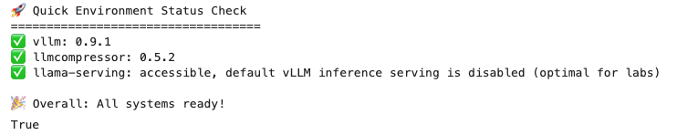

# Validate the Lab Environment

In this exercise you will validate that the lab environment has properly configured with everything that is needed to successfully run the lab.

In JupyterLab, open the notebook: <a href="https://github.com/odh-labs/rhoai-roadshow-v2/blob/main/docs/4-rhaiis/notebooks/0-validate-environment.ipynb" target="_blank">0-validate-environment.ipynb</a>

Follow all instructions from inside the Notebook. if your environment has been provisioned correctly then you will see a result like the following:

You are now ready to proceed to the next activity.
