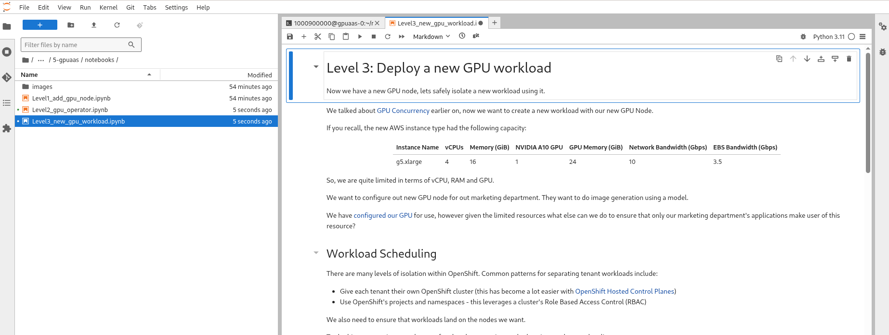

# Deploy a new GPU workload

Clone the code using your github user into your workbench by using the `Terminal` and entering:

```bash
git clone https://github.com/odh-labs/rhoai-roadshow
```


Open up the following notebook in your workspace.

<a href="https://github.com/odh-labs/rhoai-roadshow/blob/main/site/docs/6-gpuaas/notebooks/Level3_new_gpu_workload.ipynb" target="_blank">Level3_new_gpu_workload.ipynb</a>

We will cover how we can deploy and isolate new workloads using our new GPU node.


