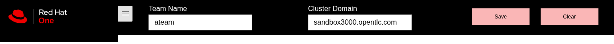

# Red Hat OpenShift AI Roadshow

<!-- panels:start -->
<!-- div:floating-cat -->

<!-- panels:end -->

<!-- tabs:start -->

#### **English**

🐑🐑 Hello! 🐑🐑

#### **French**

🐀🐀 Bonjour! 🐀🐀

#### **Italian**

🦜🦜 Ciao! 🦜🦜

#### **Spanish**

🦄🦄 Hola 🦄🦄

#### **Japanese**

🦩🦩 こんにちは 🦩🦩

#### **Chinese**

🐼 你好 🐼

<!-- tabs:end -->

Welcome the the RHOAI Roadshow. Each of the modules is self-contained so can be run on the provided environment separately.

You get to choose the adventure you wish to explore Red Hat OpenShift AI with.

?> **Tip** Be sure to set your cluster domain and team name in the top navigation bar and hit `Save` - this updates the documentation hyperlinks to point to your cluster.

